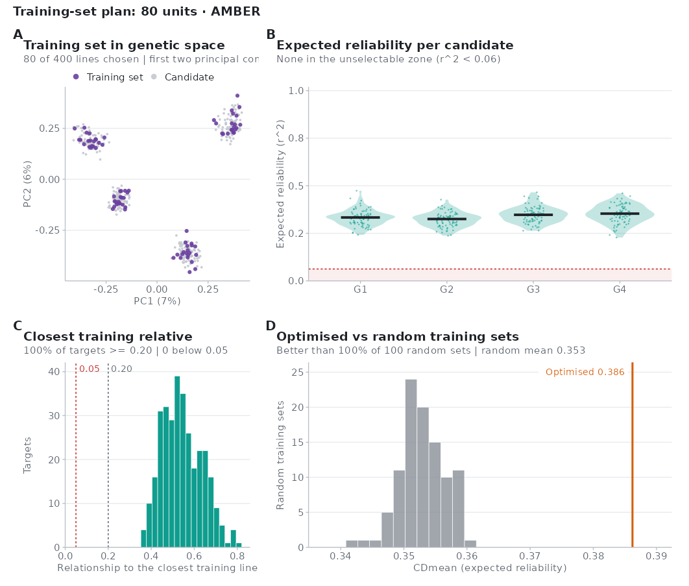
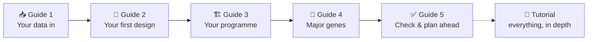
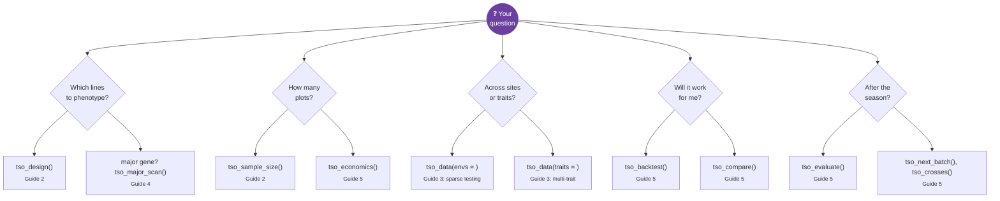
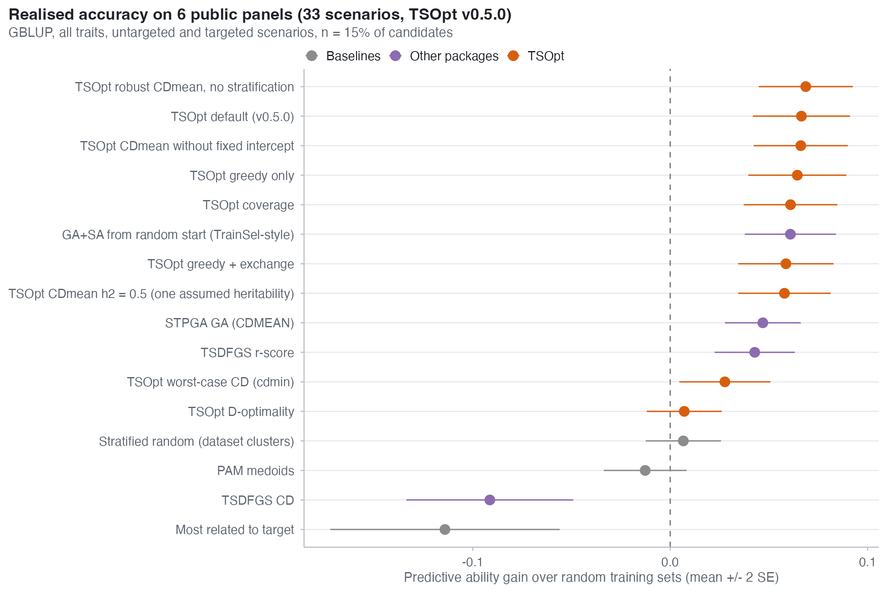

<div align="center">


# Phenotype the right lines. Predict the ones you select.

**Training-set design for genomic prediction, in every crop and every breeding system.**

[](CHANGELOG.md)
[](docs/INSTALL.md)
[-0F9D8E?style=for-the-badge)](docs/INSTALL.md)
[](LICENSE)

**[Get TSOpt](#-get-tsopt-in-three-steps)** ·
**[Learn it](#-learning-paths)** ·
**[Find your answer](#-what-is-your-question)** ·
**[Evidence](#-does-it-work)** ·
**[Security](SECURITY.md)** ·
**[Cite](#-cite)**

</div>

---

Genotyping is cheap and phenotyping is not. Every season a breeding programme decides which of its genotyped
candidates get a field plot, and that decision sets how well genomic prediction will work. **TSOpt makes that
decision for you, exactly and in a fraction of a second, and tells you how much it is worth.**

<table>
<tr>
<td width="33%" valign="top">

### ⚡ Exact and fast
The design criterion (CDmean) is computed **exactly**, with fixed effects projected out, by rank-one updates of
the prediction error variance. **A design takes milliseconds**, not minutes.

</td>
<td width="33%" valign="top">

### 🛡️ Robust by default
Heritability is never known in advance, so the default design is averaged over it, or over **REML estimates
from your own trials**. In a head-to-head benchmark on public panels it was as accurate as or better than other packages, and far faster.

</td>
<td width="33%" valign="top">

### 🌾 Every breeding system
Inbred lines, doubled haploids, hybrids, testcrosses, clones, polyploids, genebanks, **several traits and
sites (sparse testing)**, major genes, haplotypes, historical data and plot costs, all in one engine.

</td>
</tr>
<tr>
<td valign="top">

### 🔁 Tested forward in time
Replay your own programme's history season by season (`tso_backtest()`) before you trust any design, including
ours.

</td>
<td valign="top">

### 📋 From plan to field
Checks for every plan, the value of each plot, field layouts, Field Book / FielDHub / Breedbase exports and
**BrAPI write-back** to your breeding database.

</td>
<td valign="top">

### 🔒 Private by design
Runs on your own computer, **offline**. Your genotypes, phenotypes and plans never leave it. The licence key
is checked locally.

</td>
</tr>
</table>

---

## 🚀 Get TSOpt in three steps

TSOpt is **free for everyone**, including companies and their commercial breeding. You register once for a
personal licence key.


| Step | What to do |
|:--:|:--|
| **1** | **Request your free key.** Email **[waseemhussain@plantnura.com](mailto:waseemhussain@plantnura.com?subject=TSOpt%20licence%20key%20request&body=Name%3A%0AOrganisation%3A%0ACountry%3A%0AIntended%20use%3A%0A%0AI%20accept%20the%20TSOpt%20licence%20terms.)** with your name, organisation, country and intended use. You receive a personal key, usually within two working days. [How keys work →](docs/LICENCE_KEY.md) |
| **2** | **Install the package** from the **[Releases](../../releases)** page (no compiler needed). Available now for **macOS on Apple silicon (M1–M4) with R 4.5** (file `TSOpt_0.5.0_macos-arm64.tgz`); Windows, Intel Mac and Linux builds are being prepared. [Installation guide →](docs/INSTALL.md) |
| **3** | **Activate the key** once: `library(TSOpt); tso_licence("TSO1....")`. It is saved on your computer. |

```r
install.packages(c("data.table", "ggplot2", "scales", "jsonlite", "patchwork"))   # once
install.packages("~/Downloads/TSOpt_0.5.0_macos-arm64.tgz", repos = NULL)   # the file from Releases (macOS, Apple silicon)

library(TSOpt)
tso_licence("TSO1....")                              # your key, once

panel <- tso_data("my_panel.vcf.gz")                 # VCF, HapMap, PLINK, DArT, CSV, Excel, or BrAPI
tso_diagnose(panel, n = 150)                         # is optimisation worth it? how many lines?
plan  <- tso_design(panel, n = 150)                  # which 150 lines to phenotype
tso_plot(plan)                                       # the summary figure
tso_export(plan, "trial.csv")                        # the list for the field team
```

<div align="center">

<br/><sub><i>Every plan comes with a verdict, its expected accuracy against random sampling, coverage of the targets, and the value of each plot.</i></sub>
</div>

---

## 🎓 Learning paths

Five step-by-step guides take you from a genotype file to a finished plan. The complete tutorial covers the
theory, every function with live examples, recipes and an FAQ. All of them are PDFs, and every number and
figure in them was produced by the code shown.



| | Guide | What you will learn | Time |
|:--:|:--|:--|:--:|
| 📥 | **[Guide 1: Your data in](docs/guides/guide-1-data.pdf)** | Read any genotype format, quality control, relationship matrices and kernels, BrAPI databases | 20 min |
| 🌱 | **[Guide 2: Your first training set](docs/guides/guide-2-first-design.pdf)** | Should you optimise at all? How many lines? Design, explain and hand the plan over | 20 min |
| 🏗️ | **[Guide 3: Designing for your programme](docs/guides/guide-3-programme.pdf)** | Targets, budgets, checks and history, variance components from your trials, hybrids, testcrosses, sparse testing, several traits, omics | 45 min |
| 🧬 | **[Guide 4: Major genes, haplotypes and fixed effects](docs/guides/guide-4-major-genes.pdf)** | Find or import major loci, protect their alleles, haplotype blocks and coverage | 30 min |
| ✅ | **[Guide 5: Check, decide and plan ahead](docs/guides/guide-5-check-plan-ahead.pdf)** | Would it have worked in your programme? How sure is the gain? How many plots pay off? The next season | 40 min |
| 📘 | **[The complete tutorial](docs/tutorial/TSOpt_Tutorial.pdf)** (127 pages) | Theory worked by hand, all 18 criteria, the search algorithms, every function, breeding systems, the benchmark, 40 recipes, FAQ, crosswalk from other packages | reference |
| 🧪 | **[The walkthrough on your own data](docs/walkthrough/TSOpt_Walkthrough.pdf)** ([R Markdown](docs/walkthrough/TSOpt_Walkthrough.Rmd)) | Runs **every** function on *your* files and checks each result: 184 automatic checks and a scorecard | 30 min |
| 📖 | **[Reference manual](docs/reference/TSOpt_Reference_Manual.pdf)** | Every function and every argument | reference |

The guides also come inside the package. After installing, run `tso_docs()`.

### Choose your path

| You are... | Read | Then try |
|:--|:--|:--|
| 🧑‍🌾 **A breeder with one trial to plan this season** | Guide 1 → Guide 2 | `tso_diagnose()`, `tso_design()`, `tso_export()` |
| 🏢 **A programme manager** (budgets, stages, sites) | Guide 2 → Guide 3 → Guide 5 | `tso_economics()`, `tso_season()`, `tso_backtest()` |
| 🧮 **A quantitative geneticist** | Tutorial parts 2–4 → Guide 3 | `tso_variance()`, `tso_kernels()`, `tso_compare()` |
| 🧬 **Working with a known major gene** | Guide 1 → Guide 4 | `tso_major_scan()`, `tso_major_effects()` |
| 🗄️ **A data manager** (databases, pipelines) | Guide 1 (BrAPI) → Tutorial part 11 | `tso_brapi_connect()`, `tso_export_field()`, the `tsopt` command line |

---

## 🧭 What is your question?

Start from the decision you face; each answer names the function and where it is explained.



| Your question | Function | Explained in |
|:--|:--|:--|
| Which of my candidates should get a plot? | `tso_design()` | [Guide 2](docs/guides/guide-2-first-design.pdf) |
| Is optimising worth it here, and how many lines do I need? | `tso_diagnose()`, `tso_sample_size()` | [Guide 2](docs/guides/guide-2-first-design.pdf) |
| I have a budget, unequal plot costs, checks and last year's data | `tso_design(budget = , history = )` | [Guide 3](docs/guides/guide-3-programme.pdf) |
| Which lines in which sites? (sparse testing) | `tso_data(envs = )` + `tso_design()` | [Guide 3](docs/guides/guide-3-programme.pdf) |
| Which trait on which line? | `tso_data(traits = )` + `tso_design(index = )` | [Guide 3](docs/guides/guide-3-programme.pdf) |
| Hybrids, testers, heterotic groups | `tso_data(system = "hybrid" / "testcross")` | [Guide 3](docs/guides/guide-3-programme.pdf) |
| My trait has a major gene | `tso_major_scan()`, `tso_major_effects()` | [Guide 4](docs/guides/guide-4-major-genes.pdf) |
| What are my heritabilities and site correlations, really? | `tso_variance()` | [Guide 3](docs/guides/guide-3-programme.pdf) |
| Would this have worked in my programme's past seasons? | `tso_backtest()` | [Guide 5](docs/guides/guide-5-check-plan-ahead.pdf) |
| How sure is the gain? What is each plot worth? | `tso_uncertainty()`, `tso_plot(plan, "value")` | [Guide 5](docs/guides/guide-5-check-plan-ahead.pdf) |
| How many plots pay off? | `tso_economics()` | [Guide 5](docs/guides/guide-5-check-plan-ahead.pdf) |
| Where do the next plots go? Which crosses next? | `tso_next_batch()`, `tso_crosses()` | [Guide 5](docs/guides/guide-5-check-plan-ahead.pdf) |
| Send the plan to Field Book, FielDHub, Breedbase or BMS | `tso_export_field()`, `tso_brapi_write_list()` | [Tutorial, part 11](docs/tutorial/TSOpt_Tutorial.pdf) |
| I used STPGA, TSDFGS or TrainSel before | the crosswalk table | [Tutorial, part 14](docs/tutorial/TSOpt_Tutorial.pdf) |

---

## 📈 Does it work?

On **six public panels** (maize, two rice panels, sorghum, switchgrass and white spruce, with real phenotypes,
33 scenarios; TSOpt 0.5.0), TSOpt's default improved predictive ability over random sampling by **+0.066**, winning
**88%** of scenarios. It was at least as accurate as STPGA and TSDFGS (+0.020 and +0.024 on average) and about
**1,000 to 4,000 times faster** (0.03 s instead of 40 to 120 s). Choosing the lines "most related to the targets",
a common rule of thumb, *lowered* accuracy.

<div align="center">


</div>

We also report what does **not** help. Designing under epistatic, haplotype or omics models did not change which
lines were worth phenotyping, so the additive, robust default stays. The full benchmark, with every raw result,
is in [benchmark/](benchmark/README.md), and every claim with its effect size is in [EVIDENCE.md](docs/EVIDENCE.md).

---

## 🔐 Licence, privacy and security

| | |
|:--|:--|
| **Licence** | The [TSOpt Free Licence](LICENSE). It is **free of charge for everyone**, for any purpose including commercial breeding, on your own or your organisation's computers. Do not share, redistribute, modify or reverse-engineer the software, and do not share your key. **Your data and your results are yours** to use and publish. |
| **Privacy** | TSOpt runs entirely on your computer. It sends **no data, no telemetry and no usage information** anywhere; the key is checked offline. |
| **Security** | To report a vulnerability, follow [SECURITY.md](SECURITY.md) (privately, not in a public issue). |
| **Third-party software** | Listed in [THIRD-PARTY-NOTICES](THIRD-PARTY-NOTICES). |
| **Reproducibility** | Benchmark scripts and raw results are public. The source code is available to qualified researchers and reviewers on request. [How →](docs/REPRODUCIBILITY.md) |

Never post your licence key in an issue or anywhere public. If it leaks, email us and we will issue a new one.

---

## 💬 Help

* **Bugs and questions:** [open an issue](../../issues/new/choose). Please don't attach confidential data or your key.
* **Licence keys and everything else:** [waseemhussain@plantnura.com](mailto:waseemhussain@plantnura.com).
* **What changed:** [CHANGELOG.md](CHANGELOG.md).

## 📝 Cite

If TSOpt helped your work, please cite it. Use `citation("TSOpt")` in R, or the **"Cite this repository"** button
on this page ([CITATION.cff](CITATION.cff)).

> Hussain W. (2026). *TSOpt: Training Set Optimisation for Genomic Prediction in Any Crop.* R package version
> 0.5.0. PlantNura Consulting & Solutions.

---

<div align="center">

<br/>
<sub>TSOpt is developed by <b>PlantNura Consulting & Solutions</b>. © 2026 PlantNura Consulting & Solutions. All rights reserved.</sub>
</div>
