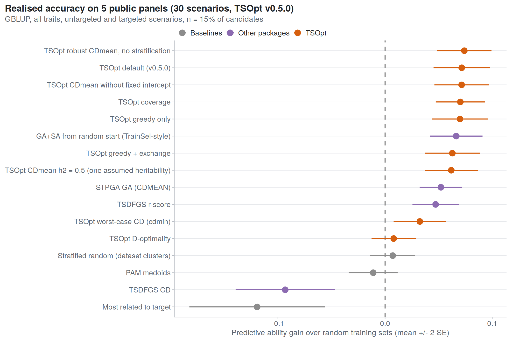
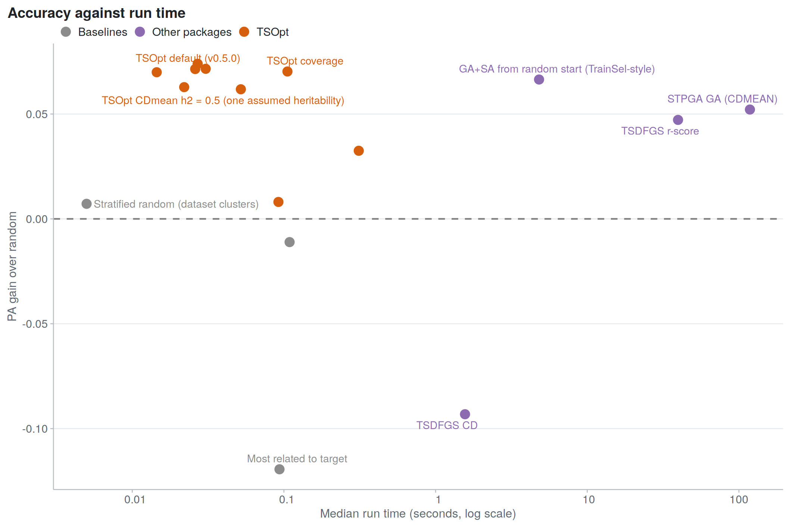

# TSOpt head-to-head benchmark (TSOpt 0.5.0)

This folder holds the scripts and every raw result behind TSOpt's published claims.

| File | What it is |
|:--|:--|
| `run_benchmark.R` | The head-to-head benchmark on six public panels (this page) |
| `analyse_benchmark.R` | Builds the tables and figures in `results/` from the raw rows |
| `results/results_*.csv` | Every raw row of the head-to-head run with TSOpt 0.5.0 |
| `results/benchmark_*.csv`, `results/fig_*.png` | The summaries and figures made from them |
| [KERNELS.md](KERNELS.md), [HAPLOTYPES.md](HAPLOTYPES.md), [OMICS.md](OMICS.md) | Benchmarks of the non-additive, haplotype and omics models |
| `forward_benchmark.R`, `major_genes_benchmark.R`, `limits.R` | Forward validation, major-gene protection, size/time/memory limits ([LIMITS.md](../docs/LIMITS.md)) |
| [TRAINSEL_PROTOCOL.md](TRAINSEL_PROTOCOL.md), `trainsel_comparison.R` | The pre-specified comparison with TrainSel, to be run by an academic partner |

All claims, with their data, effect sizes and number of runs, are collected in
[docs/EVIDENCE.md](../docs/EVIDENCE.md).

## Design

| | |
|---|---|
| Panels | The six public panels compiled by Fernández-González et al. (2023, *Theor Appl Genet* 136:30): Maize (391 lines), RicePS (357), Rice (327), Sorghum (451), Switchgrass (514) and Spruce (1,722), all traits of each. They are not redistributed here; obtain them from the original publication. |
| Scenarios | **Untargeted**: the whole pool is scored. **Targeted**: a random 25% of lines are targets and are never phenotyped; 5 splits per panel (Spruce: 2). 33 scenarios in total. |
| Budget | n = 15% of the candidates. |
| Score | Every training set is scored in the same way: realised predictive ability (PA), the correlation of GBLUP predictions (REML heritability) with the phenotypes of the targets, averaged over traits. Also NDCG@10%, exact CDmean at h2 = 0.5, and wall-clock time on one core. |
| Methods | The TSOpt default (`tso_design()` with nothing changed) and variants; **STPGA** 5.2.1 (genetic algorithm, CDMEAN); **TSDFGS** 2.0 (CD and r-score exchange); a genetic algorithm + simulated annealing from random starts on exact CDmean, in the style of TrainSel; baselines: random (5 draws), stratified random, PAM medoids, most related to the targets. |
| TrainSel | Not run. Its licence forbids use by for-profit organisations. The GA + SA reproduces its search strategy on the same exact criterion, without its code. A comparison with TrainSel itself is pre-specified in [TRAINSEL_PROTOCOL.md](TRAINSEL_PROTOCOL.md). |

**Completeness of the 0.5.0 run.** On Spruce the run with TSOpt 0.5.0 finished only the TSOpt
methods, the GA + SA, and (on two targeted splits) STPGA and TSDFGS CD; the random draws,
TSDFGS r-score and the baselines did not finish. Every comparison below therefore uses the
**30 complete scenarios on five panels**. Rerunning Spruce in full is on the to-do list.

## Results (TSOpt 0.5.0; 30 scenarios, 5 panels)

| Method | PA gain over random | Beats random | Median time |
|---|---|---|---|
| **TSOpt default (v0.5.0)** | **+0.072** | **90%** | **0.03 s** |
| TSOpt robust CDmean, no stratification | +0.074 | 93% | 0.03 s |
| TSOpt greedy only | +0.070 | 87% | 0.01 s |
| TSOpt coverage | +0.070 | 90% | 0.11 s |
| GA + SA from random start (TrainSel-style) | +0.066 | 87% | 4.8 s |
| TSOpt greedy + exchange | +0.063 | 83% | 0.02 s |
| TSOpt CDmean, h2 = 0.5 only | +0.062 | 83% | 0.05 s |
| STPGA GA (CDMEAN) | +0.052 | 83% | 118 s |
| TSDFGS r-score | +0.047 | 87% | 40 s |
| Stratified random | +0.007 | 60% | 0 s |
| PAM medoids | -0.011 | 50% | 0.1 s |
| TSDFGS CD | -0.093 | 27% | 1.6 s |
| Most related to the targets | -0.119 | 27% | 0.1 s |

The TSOpt default against each competitor on the same scenarios (30 pairs): mean advantage in PA
± standard error, the share of scenarios it wins, and a two-sided sign test.

| Competitor | Default's PA advantage | Default wins | Sign test p |
|---|---|---|---|
| Random | +0.072 ± 0.013 | 90% | < 0.001 |
| STPGA | +0.019 ± 0.011 | 57% | 0.59 |
| TSDFGS r-score | +0.024 ± 0.009 | 63% | 0.20 |
| TrainSel-style GA + SA | +0.005 ± 0.006 | 70% | 0.04 |
| TSOpt with one assumed h2 = 0.5 | +0.010 ± 0.006 | 73% | 0.02 |
| Most related to the targets | +0.191 ± 0.030 | 87% | < 0.001 |




## What the results show

1. **Optimisation pays, and the default is among the best.** The default gains +0.072 PA over
   random and beats it in 90% of scenarios.
2. **Against STPGA and TSDFGS: as accurate or better, about 1,000 to 4,000 times faster.** The
   average advantage is +0.02, but it is not consistent scenario by scenario (wins 57-63%,
   sign test not significant). The clear difference is time: 0.03 s against 40-118 s.
3. **Hedging over heritability helps.** Averaging CDmean over h2 = 0.2, 0.5 and 0.8 beats a
   single assumed h2 = 0.5 by +0.010 (73% of scenarios, p = 0.02). The supplementary probe
   (`results/h2probe_*.csv`, `results/spruce_probe.csv`, run with an earlier version)
   compared fixed h2 values from 0.1 to 0.8.
4. **A better criterion value is not a better prediction.** Exchange search reaches the
   highest CDmean at the assumed h2 but predicts less well (+0.063) than the plain greedy set.
5. **Choosing the lines most related to the targets lowers accuracy** (-0.119 against random),
   and TSDFGS's CD mode was worse than random on every panel.
6. **Two things we expected did not show in this run.** The exact fixed intercept made no
   difference (+0.000 ± 0.006); an earlier version of the benchmark had found +0.013. And
   turning stratification off was slightly ahead of the default (+0.002 ± 0.002). Neither
   changes the default in 0.5.0; both are reported as found.

Per-panel gains are in `results/benchmark_pa_gain_by_dataset.csv`.

## Reproduce

```sh
export TSO_BENCH_DATA=/path/to/Fernandez-Gonzalez_2023/Datasets   # the six panels
export TSO_BENCH_OUT=results
Rscript run_benchmark.R RicePS Rice Maize Sorghum Switchgrass Spruce   # several hours, mostly STPGA/TSDFGS
Rscript analyse_benchmark.R results results
```

The scripts need the released TSOpt binary with a licence key, STPGA and TSDFGS from CRAN, and
`cluster`. They also call a few of TSOpt's internal helpers (written `TSOpt:::name`), such as the
GBLUP fit that scores every training set in the same way; these may change between versions, so
use the TSOpt version named in the results.
