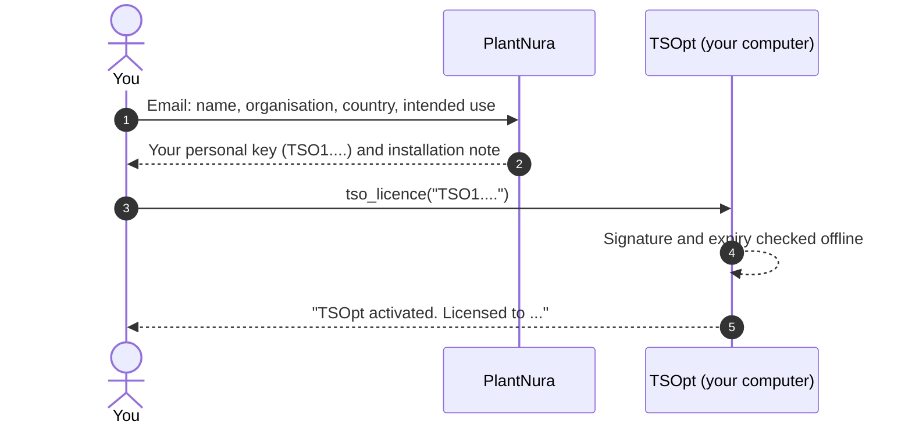

# Your TSOpt licence key

TSOpt is **free for everyone**. Each user registers once and receives a **personal licence key**. Registration
lets us tell you about updates and corrections, and it keeps TSOpt available to everyone free of charge.



## 1. Request a key

Send an email to **[waseemhussain@plantnura.com](mailto:waseemhussain@plantnura.com?subject=TSOpt%20licence%20key%20request&body=Name%3A%0AOrganisation%3A%0ACountry%3A%0AIntended%20use%3A%0A%0AI%20accept%20the%20TSOpt%20licence%20terms.)**
with:

* your name;
* your organisation (company, institute, university, or "individual");
* your country;
* one or two sentences on what you will use TSOpt for (crop, programme);
* the sentence *"I accept the TSOpt licence terms."*

If TSOpt is already installed, `tso_licence_request()` writes this email for you.

You will receive your key, usually within two working days.

## 2. Activate it, once per computer

```r
library(TSOpt)
tso_licence("TSO1....")      # the whole key, between the quotes
```

The key is saved in your R configuration folder and found automatically from then on.

* **Check it at any time:** `tso_licence()`. It shows the holder, the licence ID and the expiry date.
* **Servers, pipelines and Docker:** give the key in the environment variable `TSOPT_LICENCE` instead.

## 3. What the key is

* **Personal.** It is issued to you, or to your organisation if you named one. Colleagues in the same
  organisation may use TSOpt under it, but please ask each user to register: it costs nothing.
* **Checked offline.** The key is a signed record (licence ID, name, organisation, dates). TSOpt checks the
  signature on your computer; **nothing is ever sent anywhere**.
* **Valid for 12 months.** Before it expires, ask for a new one.
* **Recorded in your outputs.** Plans, plan files and reports record your licence ID (not your key), so a plan
  can always be traced to the licence it was made under.

## Keep it safe

* **Don't share your key** or post it in an issue, a forum, a script you publish or a repository.
* **If it leaks,** email us. We will withdraw it and issue a new one.
* **Changing computers** is fine: activate the same key on the new one.

## Questions

| Question | Answer |
|:--|:--|
| Does it cost anything? | No. TSOpt is free for everyone, including companies. |
| Can I use it for commercial breeding? | Yes. |
| Who owns my results? | You. Your data and results are yours to use and publish (please cite TSOpt). |
| Can I give the package to a colleague? | Please don't. Ask them to request their own free key; it takes a minute. |
| Does TSOpt need the internet? | No, not for the licence or for anything else, except BrAPI databases you choose to connect to. |

The full terms are in the [licence](../LICENSE).
